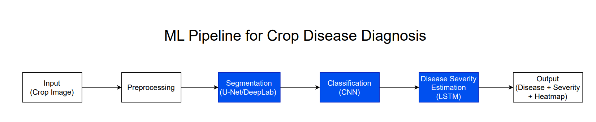
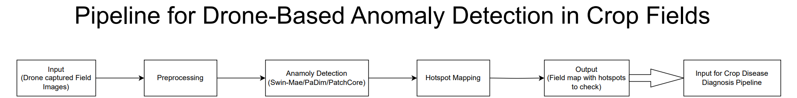

# 🌿 Crop Disease Detection & Field Anomaly Pipelines

This repository presents two complementary **machine learning pipelines** designed for **early crop disease detection and severity estimation**. Together, they form a farmer-friendly workflow where **field-level drone scans** guide farmers to suspicious regions, and **close-up crop images** confirm and classify the disease.

---

## 1️⃣ ML Pipeline for Crop Disease Diagnosis

The **Crop Disease Diagnosis pipeline** is the core component, operating on **close-up crop images** (leaf/stem) captured by farmers using mobile devices.

**Objective:** Detect disease, classify its type, and estimate severity with explainable outputs.

**Steps:**

1. **Input (Crop Image):** Farmer uploads a photo of a leaf/stem.
2. **Preprocessing:** Normalize image quality (lighting, size, augmentation).
3. **Segmentation (U-Net / DeepLab):** Isolate crop region from the background.
4. **Classification (CNN):** Identify disease type (e.g., rice blast, cotton blight).
5. **Severity Estimation (LSTM):** Quantify infection levels (mild, moderate, severe).
6. **Output:**

   * Disease name
   * Severity percentage/level
   * Heatmap overlays (Grad-CAM) showing infected regions

This pipeline ensures **high accuracy disease diagnosis** even under variable field conditions, providing farmers with actionable insights.

---

## 2️⃣ Drone-Based Anomaly Detection Pipeline

The **Drone Anomaly Detection pipeline** complements the disease diagnosis step by operating at the **field scale**.

**Objective:** Identify **suspicious regions (hotspots)** in large farm fields where anomalies (possible disease or stress) are detected. This guides farmers to capture close-up images for detailed analysis via the first pipeline.

**Steps:**

1. **Input (Drone-captured Field Images):** Low-altitude UAV scans of crop fields.
2. **Preprocessing:** Image normalization and noise removal.
3. **Anomaly Detection (Swin-MAE / PaDiM / PatchCore):** Detect unusual patterns or stressed crop regions without labeled data.
4. **Hotspot Mapping:** Generate a field map with highlighted anomaly zones.
5. **Output:**

   * Field map with **hotspot regions**
   * Farmers are directed to these hotspots to take close-up images for the **Crop Disease Diagnosis pipeline**.

This step avoids the need for farmers to randomly scout large fields and makes the system **efficient, scalable, and field-robust**.

---

## 🔗 End-to-End Flow

1. **Drone pipeline** → Detects hotspots (field-level anomaly detection).
2. **Crop image pipeline** → Diagnoses disease type and severity in hotspot regions.

Together, these pipelines provide a **two-stage, multimodal approach** for practical, accurate, and early crop disease detection.
